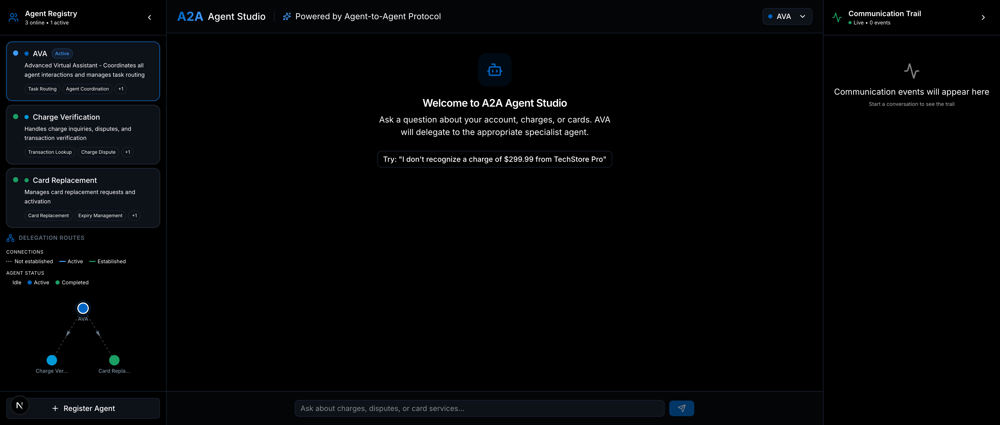
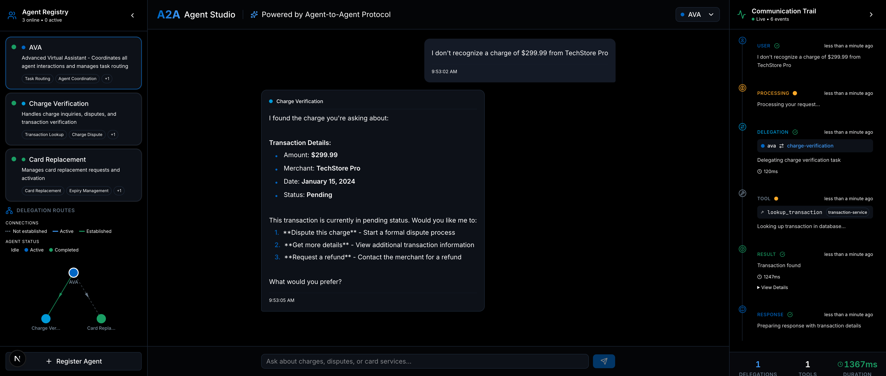

# A2A Agent Studio

A professional Agent-to-Agent (A2A) protocol demonstration showcasing how AI agents communicate, delegate tasks, and collaborate to solve complex workflows. Built with the official [A2A JavaScript SDK](https://github.com/a2aproject/a2a-js).



## Architecture

```
┌─────────────────────────────────────────────────────────┐
│                    Frontend (Next.js)                    │
│              Agent Registry │ Chat │ Trail               │
└─────────────────────────┬───────────────────────────────┘
                          │ HTTP
┌─────────────────────────┴───────────────────────────────┐
│                  Platform (Express)                      │
│           YAML Registry → HTTP Discovery                 │
└─────────────────────────┬───────────────────────────────┘
                          │ A2A Protocol
┌─────────────────────────┴───────────────────────────────┐
│               Independent A2A Agents                     │
│  ┌──────┐    ┌──────────────┐    ┌─────────────────┐    │
│  │ AVA  │───▶│Charge Verify │───▶│Card Replacement │    │
│  │:4000 │    │    :4001     │    │     :4002       │    │
│  └──────┘    └──────────────┘    └────────┬────────┘    │
└───────────────────────────────────────────┼─────────────┘
                                            │ MCP Protocol
                              ┌─────────────┼─────────────┐
                              │         MCP Servers        │
                              │  :4100 :4101 :4102 :4103   │
                              └────────────────────────────┘
```

## Components

### Agents (Self-Contained, A2A SDK)

Each agent is an independent A2A server using `@a2a-js/sdk`:

| Agent | Port | Description |
|-------|------|-------------|
| **AVA** | 4000 | Advanced Virtual Assistant - Routes customer requests |
| **Charge Verification** | 4001 | Investigates charges, handles disputes, detects fraud |
| **Card Replacement** | 4002 | Processes card replacements via MCP tools |

### MCP Servers (Mock Data)

| Server | Port | Purpose |
|--------|------|---------|
| Address Confirmation | 4100 | Verify/update mailing address |
| Delivery Method | 4101 | Standard/Express/Overnight shipping |
| Replacement Reason | 4102 | Lost/Stolen/Damaged/Fraud |
| Final Submission | 4103 | Submit replacement order |

### Platform

- **Port:** 3001
- **Discovery:** Reads `registry.yaml`, fetches Agent Cards via HTTP
- **API:** `GET /api/agents` returns all discovered agents with status

### Frontend

- **Port:** 3000
- **UI:** 3-panel layout (Agent Registry, Chat, Communication Trail)
- **Theme:** AmEx-inspired professional dark theme

## Quick Start

```bash
# Install dependencies
cd backend && npm install
cd ../frontend && npm install

# Set OpenAI API key
export OPENAI_API_KEY="sk-..."

# Start backend (agents + MCP servers + platform)
cd backend && npm run start:all

# Start frontend (separate terminal)
cd frontend && npm run dev
```

Open http://localhost:3000

## Agent Discovery

Agents are registered in `backend/registry.yaml`:

```yaml
agents:
  - id: ava
    name: AVA
    url: http://localhost:4000
    description: Central routing agent

  - id: charge-verification
    name: Charge Verification
    url: http://localhost:4001
    description: Charge investigation agent
```

The platform discovers agents by fetching their A2A Agent Cards via HTTP at `/.well-known/agent-card.json`. No filesystem scanning.

## Demo Flow

1. **Customer reports unrecognized charge** → AVA routes to Charge Verification
2. **Charge Verification presents details** → Customer confirms or disputes
3. **If fraud detected** → Delegates to Card Replacement with fraud flag
4. **Card Replacement runs MCP tools** → Address → Delivery → Reason → Submit
5. **Communication Trail shows every hop** with timestamps and durations



## Key Design Decisions

- **A2A SDK**: Agents use official `@a2a-js/sdk` with `AgentExecutor` pattern
- **YAML Registry**: Platform discovers agents via HTTP, not filesystem
- **Self-Contained**: Each agent is independent, can be deployed separately
- **MCP for Tools**: Mock data served via MCP protocol for tool abstraction
- **Real LLM**: OpenAI GPT-5.4-mini for intent classification and responses
- **No Fallback**: Frontend only communicates via HTTP API

## Tech Stack

- **Backend:** TypeScript, Express, @a2a-js/sdk, OpenAI
- **Frontend:** Next.js 15, React, Tailwind CSS, shadcn/ui, Framer Motion, Zustand
- **Protocol:** A2A (Agent-to-Agent), MCP (Model Context Protocol)
- **Discovery:** YAML registry + HTTP Agent Card fetching

## License

MIT
